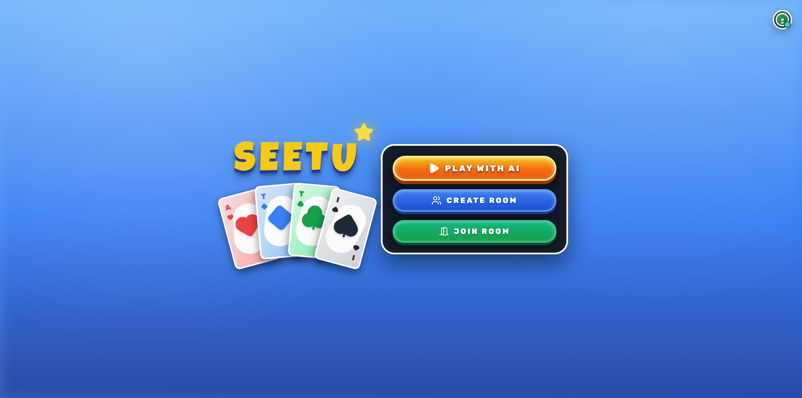
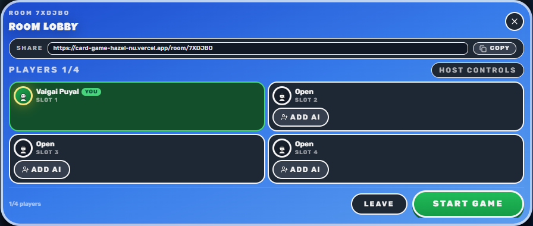
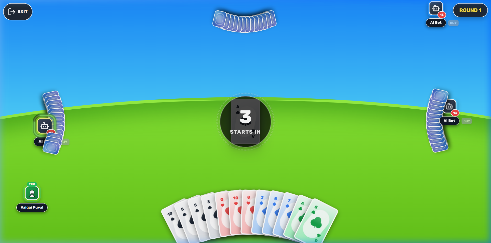
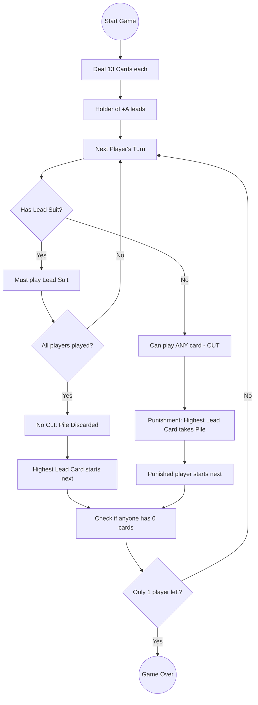

# 🃏 SEETU ATTI - Game We Used to play IRL 

[](https://reactjs.org/)
[](https://vitejs.dev/)
[](https://www.typescriptlang.org/)
[](https://tailwindcss.com/)
[](https://www.framer.com/motion/)

A high-energy, arcade-style multiplayer card game set against a playful sky-and-horizon backdrop. Experience the thrill of "Punishment" mechanics where your strongest card could be your biggest liability.

### [🎮 Play SEETU ATTI Online](https://card-game-hazel-nu.vercel.app/)

---

## 📸 Visual Showcase

<p align="center">
  
  <br>
  
  <br>
  
  <br>
</p>

---

## ✨ Key Features

- **🎮 Immersive Gameplay**: Smooth animations powered by **Framer Motion** and a responsive layout for all screen sizes.
- **📱 PWA Support**: Installable on mobile and desktop for a native-like experience.
- **🤖 Smart AI Bots**: Play against intelligent AI opponents with varying difficulty levels (Easy, Normal, Hard).
- **🌐 Peer-to-Peer Multiplayer**: Create or join rooms using **PeerJS** for real-time multiplayer action without a dedicated server.
- **🛡️ Custom Game Logic**: A unique "Punishment" system that flips traditional trick-taking on its head.
- **✨ Premium Design**: Glassmorphism, vibrant gradients, and 3D-feeling UI elements.

---

## 🧠 Game Logic & Rules

SEETU is a trick-taking punishment game where the goal is to **get rid of all your cards**.

### 1. The Setup
- **Players**: Exactly 4.
- **Deck**: Standard 52-card deck (No Jokers).
- **Distribution**: Each player receives 13 cards.

### 2. The Objective
- **Shed your cards**: Be the first to reach 0 cards to be "Safe".
- **Avoid the Pile**: The last player remaining with cards loses the game.

### 3. Core Mechanics

#### ♠️ The Lead
- The first round always starts with the **Ace of Spades (♠A)**.
- In subsequent rounds, the winner of the previous round (or the punished player) leads with any card.
- The suit of the first card played becomes the **Lead Suit**.

#### 🎯 Following Suit
- Players **must** follow the lead suit if they have it in their hand.
- If you have a card of the lead suit, you cannot play any other suit.

#### ✂️ The Cut
- If a player **does not have** any cards of the lead suit, they may "Cut" by playing any card from another suit.
- **Cutting immediately ends the round.**

#### ⚖️ Punishment
- When a cut occurs, the player who played the **highest rank card** of the lead suit (before the cut) is punished.
- The punished player must take **the entire middle pile** (including the cut card) into their hand.
- The punished player starts the next round.

#### 🏆 No-Cut Rounds
- If everyone follows suit, the pile is discarded permanently.
- The player who played the highest card of the lead suit starts the next round.

### 📈 Game Flow Diagram



---

## 🛠️ Tech Stack

- **Framework**: [React 18](https://reactjs.org/)
- **Build Tool**: [Vite](https://vitejs.dev/)
- **Language**: [TypeScript](https://www.typescriptlang.org/)
- **Styling**: [Tailwind CSS](https://tailwindcss.com/)
- **Animations**: [Framer Motion](https://www.framer.com/motion/)
- **Icons**: [Lucide React](https://lucide.dev/)
- **Networking**: [PeerJS](https://peerjs.com/) for P2P multiplayer.

---

## 🚀 Getting Started

### Prerequisites
- Node.js (v16 or higher)
- npm or yarn

### Installation
1. Clone the repository:
   ```bash
   git clone https://github.com/amarnath3003/CardGame.git
   ```
2. Navigate to the project directory:
   ```bash
   cd CardGame
   ```
3. Install dependencies:
   ```bash
   npm install
   ```

### Development
Start the development server:
```bash
npm run dev
```
The app will be available at `http://localhost:5173`.

### Production
Build the project for production:
```bash
npm run build
```

---

## 📡 Multiplayer (How it works)

SEETU uses **PeerJS** to establish direct peer-to-peer connections between players.
- **Host**: Creates a room and receives a unique Room ID.
- **Joiner**: Enters the Room ID to connect directly to the host.
- No central server is required for gameplay data, ensuring low latency and privacy.

---

## 📜 License

This project is licensed under the MIT License - see the [LICENSE](LICENSE) file for details.

---

<p align="center">Made with ❤️ for Card Game Enthusiasts</p>
